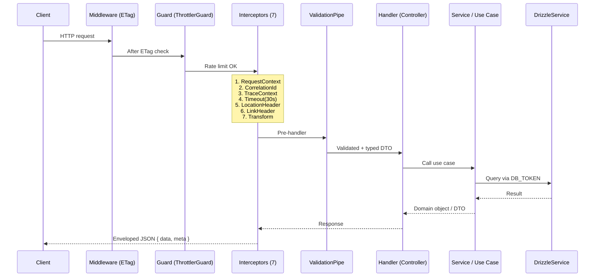

# System Architecture

## Overview

`apps/api` is a NestJS 11 monolith using a **Modular Layered Architecture** with
**DDD-lite** primitives. No microservices, no CQRS framework — a deliberate starting point
that can be evolved incrementally.

Cross-cutting code is extracted into two pnpm workspace packages:
`@boilerplate/shared-kernel` (transport-agnostic) and `@boilerplate/nest-http` (HTTP layer).
`apps/api` is the composition root — it imports from both packages and owns only
business modules (`AppModule`, `main.ts`, `modules/`).

For per-module file inventories, DI token lists, and code-level details see the
[Infrastructure deep-dive docs](./infrastructure/README.md).

---

## Workspace Package Inventory

| Package | Path | Layer |
|---------|------|-------|
| `@boilerplate/database` | `packages/database/` | Drizzle ORM schema + migrations |
| `@boilerplate/shared-kernel` | `packages/shared-kernel/` | Transport-agnostic NestJS modules: config namespaces, DB module + `DB_TOKEN`, cache port + `CACHE_PORT`, domain events, logger, `Env`/zod schema, BullMQ queue scaffold |
| `@boilerplate/nest-http` | `packages/nest-http/` | HTTP cross-cutting: exception filters, interceptors, ETag middleware, health module, HTTP configs, `configureHttpApp` / `createHttpApp` bootstrap, decorators, DTOs |
| `apps/api` | `apps/api/` | Composition root — `AppModule`, `main.ts`, business `modules/` |

### Package Dependency DAG

```
apps/api ──────────────────────────────────────────────────► @boilerplate/nest-http
                                                                      │
                                                                      ▼
future-worker ──────────────────────────────────────► @boilerplate/shared-kernel
                                                                      │
                                                                      ▼
                                                          @boilerplate/database
```

Edges are one-directional and enforced by per-package dependency-cruiser configs that extend a shared root base (`.dependency-cruiser.base.mjs`).
A future NestJS worker app can depend on `@boilerplate/shared-kernel` directly
without pulling in any HTTP dependencies.

---

## Layer Model

```
┌──────────────────────────────────────────────────┐
│  Presentation Layer                              │
│  Controllers · DTOs · Swagger decorators         │
├──────────────────────────────────────────────────┤
│  Application Layer                               │
│  Use-case services · Ports (interfaces)          │
├──────────────────────────────────────────────────┤
│  Domain Layer                                    │
│  Aggregate roots · Domain events · Value objects │
├──────────────────────────────────────────────────┤
│  Infrastructure Layer                            │
│  Adapters · DB · Cache · HTTP clients            │
└──────────────────────────────────────────────────┘
```

Domain modules live under `apps/api/src/modules/<domain>/<layer>/`.
Cross-cutting concerns live in `@boilerplate/shared-kernel` and `@boilerplate/nest-http`.

---

## Request Lifecycle



### Filter Execution Order

NestJS invokes exception filters in **reverse registration order**.
Filters are registered inside `configureHttpApp` in `@boilerplate/nest-http` (top → bottom):

```
ThrottlerExceptionFilter   ← most specific, runs first on ThrottlerException
ProblemDetailsFilter       ← shapes all HttpException → RFC 9457
AllExceptionsFilter        ← ultimate fallback (catch-all)
```

See [Handling Error](./infrastructure/handling-error.md) for filter implementation details.

---

## Cross-Cutting Pipeline

### Middleware (NestJS `configure()`)

| Middleware | Applied To | Effect |
|-----------|-----------|--------|
| `ETagMiddleware` | `{*path}` | Adds ETag header for cache revalidation |

### Guards (Global, via `APP_GUARD`)

| Guard | Trigger |
|-------|---------|
| `ThrottlerGuard` | Every request; skip with `@SkipThrottle()` |

### Interceptors (Global, execution order)

| # | Interceptor | Responsibility |
|---|------------|---------------|
| 1 | `RequestContextInterceptor` | Seeds CLS store with traceparent, writes tracing headers to response |
| 2 | `CorrelationIdInterceptor` | Reads/generates `X-Request-Id`, stores in CLS |
| 3 | `TraceContextInterceptor` | W3C `traceparent` + `tracestate` propagation |
| 4 | `TimeoutInterceptor` | Cancels handler after `REQUEST_TIMEOUT_MS` (= `ms('30s')`) with 408 |
| 5 | `LocationHeaderInterceptor` | Adds `Location` header on 201 Created |
| 6 | `LinkHeaderInterceptor` | Adds `Link` header for paginated responses |
| 7 | `TransformInterceptor` | Wraps successful responses in `{ data, meta }` envelope |

### Pipes (Global)

| Pipe | Config |
|------|--------|
| `ValidationPipe` | `whitelist`, `forbidNonWhitelisted`, `enableImplicitConversion: false` |

See [Security and Middleware](./infrastructure/security-and-middleware.md) for full pipeline configuration.
See [Request Validation](./infrastructure/request-validation.md) for `ValidationPipe` details and DTO conventions.
See [Response](./infrastructure/response.md) for envelope shape and pagination.

---

## DDD-Lite Patterns

### Aggregate Root

```
BaseAggregateRoot (abstract)
  #domainEvents: DomainEvent[]   ← private, encapsulated
  + addDomainEvent(event)
  + getDomainEvents(): DomainEvent[]
  + clearDomainEvents()
```

Domain modules extend `BaseAggregateRoot`. Use-case services call
`DomainEventPublisher.publish(aggregate)` after persisting.

### Domain Event Flow

```
Use Case Service
  │ 1. persist aggregate (Drizzle)
  │ 2. DomainEventPublisher.publish(aggregate)
  │      └─ clearDomainEvents() → emit each via EventEmitter2
  │              └─ @OnEvent() listeners react
  └─ (no outbox — at-most-once, in-process only)
```

### Integration Events

`IntegrationEvent` base class exists for cross-service events.
No transport wired yet (outbox / message broker is a future milestone).

### Port / Adapter (Dependency Inversion)

```
Application Layer defines:
  CachePort interface + CACHE_PORT Symbol

Infrastructure Layer provides:
  CacheService (cache-manager + @keyv/redis) registered as { provide: CACHE_PORT, useClass: CacheService }

Consumers inject:
  @Inject(CACHE_PORT) private readonly cache: CachePort
```

### Domain Module Structure

Each business feature is a self-contained module under
`apps/api/src/modules/<domain>/`, split into the four layers above.
Dependencies point inward — infrastructure depends on application ports,
never the reverse.

```
modules/<domain>/
├── <domain>.module.ts     ← wires providers, controllers, port→impl bindings
├── domain/                ← aggregates · value-objects · enums · events  (pure)
├── application/           ← services (use cases) · ports · listeners
├── infrastructure/        ← repositories · adapters  (implements ports)
└── presentation/          ← controllers · dtos · guards
```

```
presentation ──► application ──► domain
                     ▲
infrastructure ──────┘   (implements application/ports via DI tokens)
```

Simple CRUD modules may omit `domain/`. Rich modules enforce invariants in an
aggregate that extends `BaseAggregateRoot` and emits domain events. See
`docs/code-standards.md` → "DDD Module Pattern" for file-naming and the
port/token convention.

---

## Database Connection Model

```
DrizzleModule.forRoot() [Global Dynamic Module]
  └─ db.provider.ts: new Pool({ connectionString, max, min, ... })
       └─ drizzle(pool, { schema })  ← DB_TOKEN value
            └─ DrizzleService.db / DrizzleService.pool
                 └─ onModuleDestroy → pool.end()  (SIGTERM drain)
```

Schema types imported from `@boilerplate/database` workspace package.
No repository abstraction layer yet — handlers receive `DB_TOKEN` directly.

See [Database](./infrastructure/database.md) for pool config, migration workflow, and `withTimeout` helper.

---

## Module Dependency Graph (Infrastructure)

```
AppModule
├── ConfigModule (global)          ← Zod env validation; loads appConfig, databaseConfig, redisConfig, httpConfig, throttleConfig
├── ClsModule (global)             ← request-scoped context store  (@boilerplate/nest-http createClsConfig)
├── LoggerModule                   ← nestjs-pino  (@boilerplate/shared-kernel)
├── EventEmitterModule             ← wildcard, delimiter "."
├── DrizzleModule (global)         ← DB_TOKEN  (@boilerplate/shared-kernel); self-loads databaseConfig via ConfigModule.forFeature
├── DomainEventsModule (global)    ← DomainEventPublisher  (@boilerplate/shared-kernel)
├── ThrottlerModule                ← rate limiting  (throttleConfig from @boilerplate/nest-http)
├── HealthModule                   ← /livez /readyz /health  (@boilerplate/nest-http)
└── CacheModule                    ← CACHE_PORT adapter  (@boilerplate/shared-kernel); self-loads redisConfig via ConfigModule.forFeature
```

`DrizzleModule`, `CacheModule`, and `QueueModule` are self-contained: each calls `ConfigModule.forFeature(...)` internally to register its typed config factory regardless of how the host app wires `ConfigModule`.

All `@Global()` modules are enforced by the architecture guard test
(`packages/shared-kernel/src/__tests__/unit/global-modules.spec.ts`).

---

## Health Probe Architecture

| Endpoint | Route | Checks | Orchestrator Use |
|----------|-------|--------|-----------------|
| `GET /livez` | No `/api` prefix | Memory heap only | Liveness probe |
| `GET /readyz` | No `/api` prefix | DB (SELECT 1) + Redis (SET/GET readback), `HEALTH_TIMEOUT_MS` (= `ms('3s')`) timeout | Readiness probe |
| `GET /health` | No `/api` prefix | All of readyz + heap + RSS + disk | Debugging only |

503 responses have sanitized bodies (no internal details exposed).
All health routes are `@Public()` (bypass auth) and `@SkipThrottle()`.

---

## Graceful Shutdown

`main.ts` hoists the `app` reference before `app.listen()` so that fatal process signal handlers can call it:

```
process.on('unhandledRejection' | 'uncaughtException')
  └─ app.close()          ← drains HTTP, Postgres pool, BullMQ workers
       └─ setTimeout(SHUTDOWN_GRACE_MS).unref()  ← hard-stop fallback; SHUTDOWN_GRACE_MS = ms('5s')
```

`DrizzleService.onModuleDestroy()` ends the pg Pool. `QueueProcessorBase.onModuleDestroy()` calls `worker.close(false)` with a `QUEUE_DRAIN_TIMEOUT_MS` (= `ms('5s')`) timeout race before hard exit.

---

## Queue Architecture

Connection model, failure/retry logic, and DLQ approach:
see [Queue](./infrastructure/queue.md).

```
QueueModule [@Global()]
  ├─ producer connection  (configKey: 'queue')           ← BullMQ Queue instances
  └─ processor connection (configKey: 'queue-processor') ← BullMQ Worker instances
```

Both connections resolve from `QUEUE_REDIS_URL ?? REDIS_URL`. Queue Redis is fully separate from the cache `@keyv/redis` client.

---

## Security Layers

| Layer | Mechanism |
|-------|-----------|
| Headers | Helmet (HSTS, X-Content-Type-Options, X-Frame-Options, …); scoped CSP on `/swagger` + `/docs` HTML routes; CSP off on JSON API routes |
| CORS | Env-driven `ALLOWED_ORIGINS`; exposes `X-Request-Id` |
| Rate limiting | `ThrottlerGuard` as `APP_GUARD`; `THROTTLE_TTL` ≥ 1000 ms enforced by Zod |
| Payload | 100 KB JSON body limit (express.json) |
| Env validation | Zod rejects placeholder secrets and insecure config in production |
| Logging | Sensitive field redaction in pino config; health probe errors log `errorName` only |

See [Security and Middleware](./infrastructure/security-and-middleware.md) for full details.

---

## Observability Stack

| Concern | Tool |
|---------|------|
| Structured logging | `nestjs-pino` (pino) |
| Request tracing | W3C `traceparent` via `nestjs-cls` + `TraceContextInterceptor` |
| Correlation | `X-Request-Id` via `CorrelationIdInterceptor` |
| Health | `@nestjs/terminus` (Drizzle + Redis indicators) |
| API docs | `@nestjs/swagger` + `@scalar/nestjs-api-reference` (non-prod) |

See [Logger](./infrastructure/logger.md) for pino configuration, redaction paths, and CLS correlation.

### Known Compatibility Notes

**Nest 11 + nestjs-pino: LegacyRouteConverter warning**

`nestjs-pino` registers its middleware with a default `forRoutes: ['*']` (legacy Express 4 wildcard).
Under NestJS 11 + Express 5 (path-to-regexp v8), this triggers a `LegacyRouteConverter` deprecation
warning at startup because bare `*` is no longer a valid wildcard pattern.

Fix applied in `packages/shared-kernel/src/logger/logger.config.ts`: the `LoggerModule` options override
`forRoutes` to use the Express 5 / path-to-regexp v8 named-wildcard syntax:

```ts
forRoutes: [{ path: '{*path}', method: RequestMethod.ALL }]
```

This suppresses the warning while preserving identical coverage (all routes). Required whenever
`setGlobalPrefix('api')` is used with `nestjs-pino` under NestJS 11 + path-to-regexp v8 / Express 5.

---

## Unresolved Architectural Questions

1. **Resolved** — Repository pattern: domain modules define per-module repository ports in `application/ports/` (DIP); implementations under `infrastructure/repositories/` inject `DB_TOKEN`. Infrastructure-only code (e.g. health indicators) may use `DB_TOKEN` directly.
2. Outbox pattern for domain events — required for reliable at-least-once delivery.
3. CQRS adoption — evaluate when read models diverge significantly from write models.
4. Auth module integration — no auth deps in `apps/api`; auth strategy and wiring are a future milestone.
